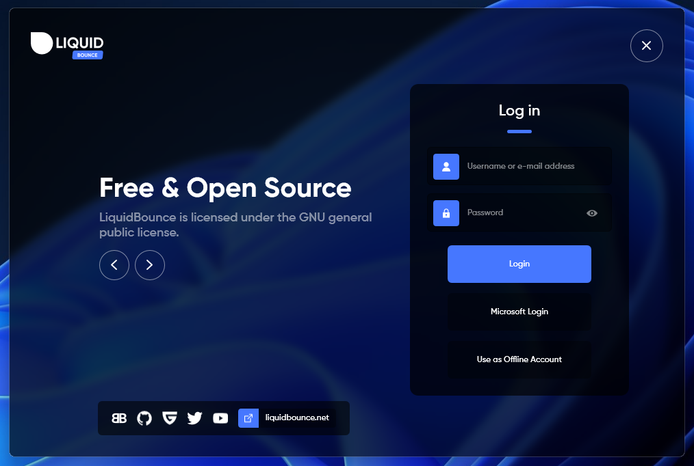
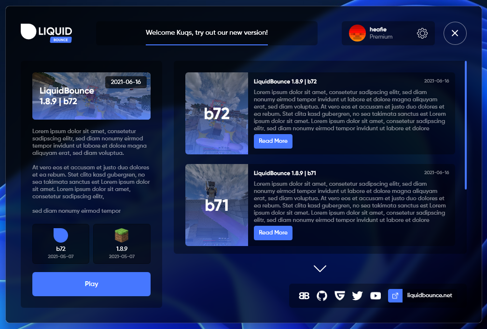
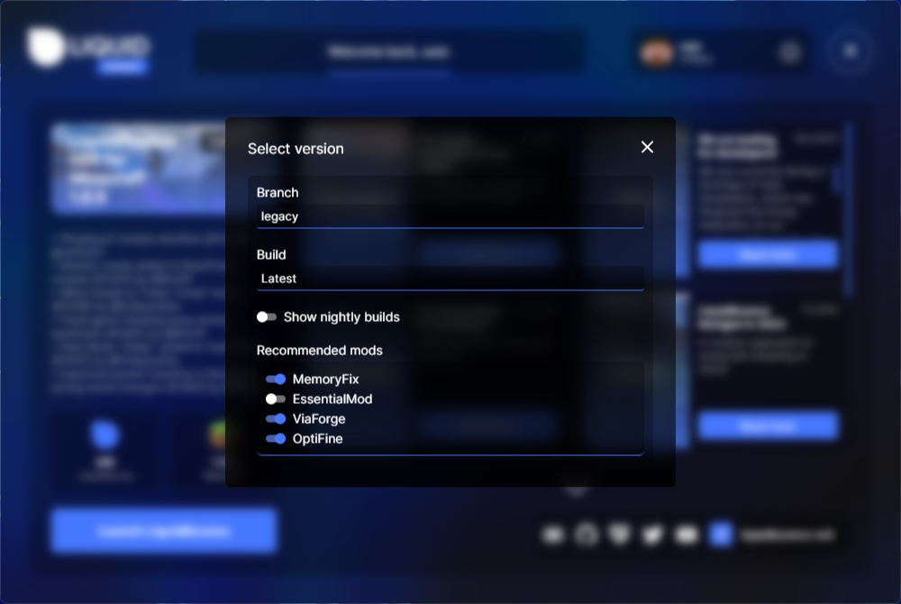
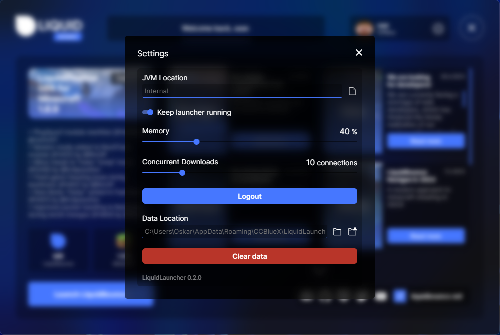
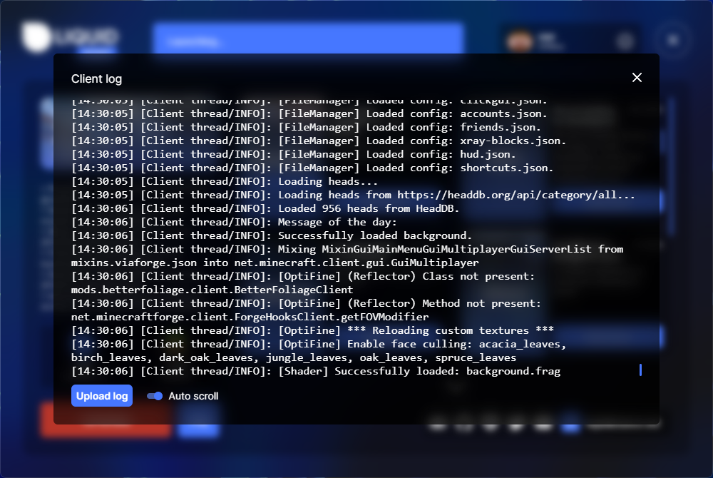

# LiquidLauncher
The official launcher for LiquidBounce.

Website: https://liquidbounce.net \
Forum: https://forums.ccbluex.net \
Guilded: https://guilded.gg/CCBlueX \
YouTube: https://youtube.com/CCBlueX \
Twitter: https://twitter.com/CCBlueX

## Screenshots
<table>
    <tr>
        <td>
            
        </td>
        <td>
            
        </td>
    </tr>
    <tr>
        <td>
            
        </td>
        <td>
            
        </td>
    </tr>
    <tr>
        <td>
            
        </td>
    </tr>
</table>

## Issues
If you notice any bugs or missing features, you can let us know by opening an issue [here](https://github.com/CCBlueX/LiquidLauncher/issues).

## License
This project is subject to the [GNU General Public License v3.0](LICENSE). This does only apply for source code located directly in this clean repository. During the development and compilation process, additional source code may be used to which we have obtained no rights. Such code is not covered by the GPL license.

For those who are unfamiliar with the license, here is a summary of its main points. This is by no means legal advice nor legally binding.

You are allowed to
- use
- share
- modify

this project entirely or partially for free and even commercially. However, please consider the following:

- **You must disclose the source code of your modified work and the source code you took from this project. This means you are not allowed to use code from this project (even partially) in a closed-source (or even obfuscated) application.**
- **Your modified application must also be licensed under the GPL** 

Do the above and share your source code with everyone; just like we do.

## Icons
We use [Clarity Line Icons](https://www.svgrepo.com/collection/clarity-line-icons/) for this project.

## Compile it yourself!
LiquidLauncher is using Tauri and is written in the programming language Rust, so make sure that it is installed properly. Instructions can be found on [Rust's website](https://www.rust-lang.org/learn/get-started). It also requires NodeJS and bun.
1. Clone the repository using `git clone --recurse-submodules https://github.com/CCBlueX/LiquidLauncher`. 
2. Navigate into your local repository folder.
3. Execute the command `bun install && bun run build`
4. Now you can start the launcher using `bun run tauri dev` or build it by using `bun run tauri build`

### Windows: automatic setup

If you are on Windows and do not want to install the toolchain by hand, run **`setup.bat`**
from the repository root. It checks what you already have and downloads *only* what is
missing — nothing is reinstalled, upgraded or duplicated.

```
setup.bat            check, then install anything missing, then run "bun install"
setup.bat /check     report what is missing and exit, install nothing
```

It verifies and, if needed, installs:

| Component | Why it is needed | Installed from |
|---|---|---|
| Visual Studio Build Tools (C++ workload) | provides the MSVC linker Rust needs on Windows | `aka.ms/vs/17/release/vs_BuildTools.exe` |
| WebView2 runtime | the browser engine Tauri renders the UI in (preinstalled on Windows 11) | Microsoft Evergreen bootstrapper |
| Rust + `rustup`, nightly channel | the backend in `src-tauri/` — nightly is pinned by `rust-toolchain.toml` | `rustup.rs` |
| bun | package manager and task runner used by this project | `bun.sh/install.ps1` |
| Node.js LTS | required by the Vite/Svelte frontend toolchain | `winget` (`OpenJS.NodeJS.LTS`) |

Notes:

- Only the Build Tools, WebView2 and Node.js steps need administrator rights. The script
  requests elevation with a single UAC prompt *and only if* one of those is actually
  missing; Rust and bun install per-user with no prompt.
- The Build Tools download is large (~3–4 GB) and is by far the slowest step.
- Open a **new** terminal after the first run so the updated `PATH` is picked up.
- If the Build Tools installer asks for a reboot, reboot before building.

## Imprint

**CCBlueX**  
Vahrenwalder Str. 269A
30179 Hanover
Germany

**Owner and responsible for the content:** Marco Beyer

## Contributing

We appreciate contributions. So if you want to support us, feel free to make changes to LiquidLauncher's source code and submit a pull request.
