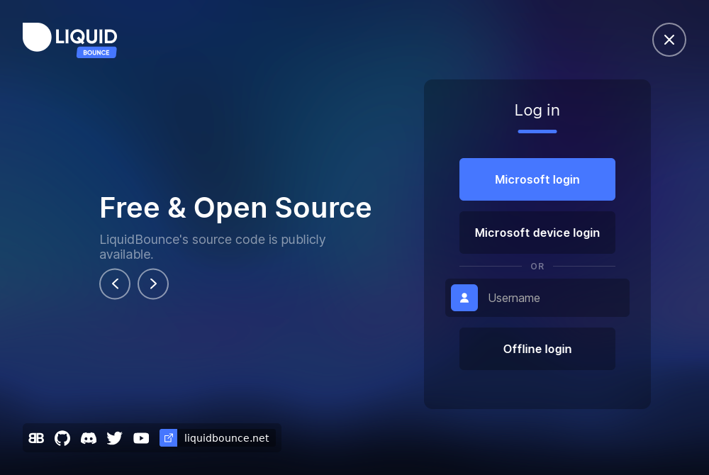
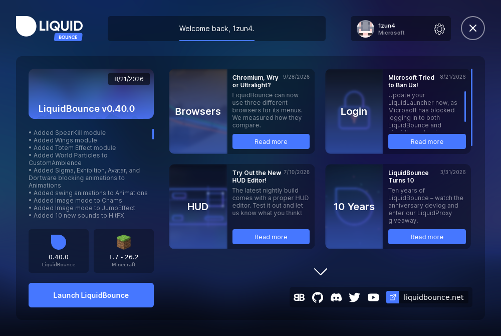
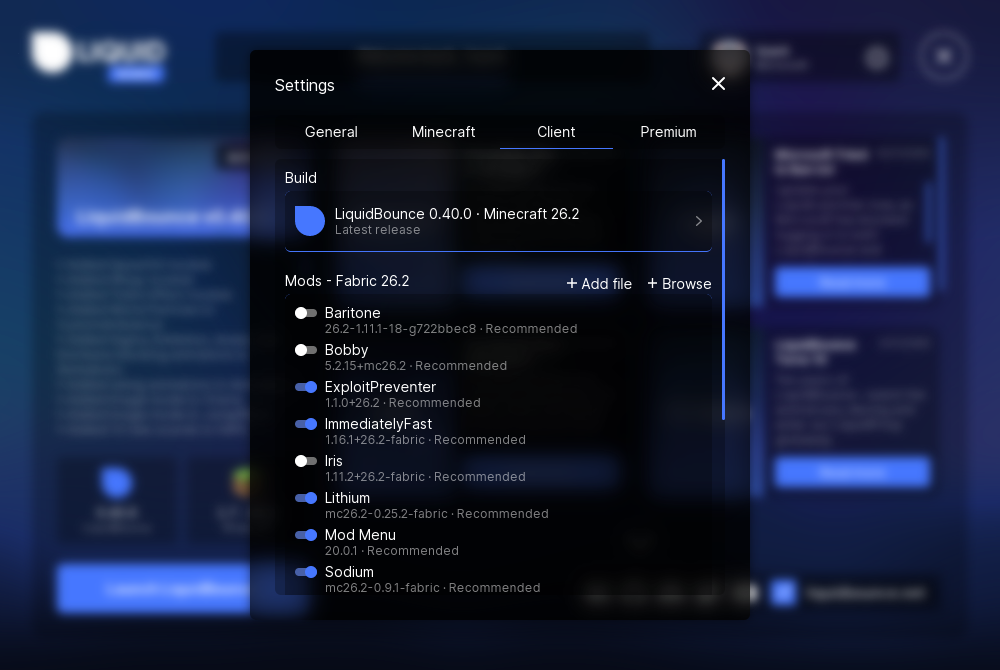
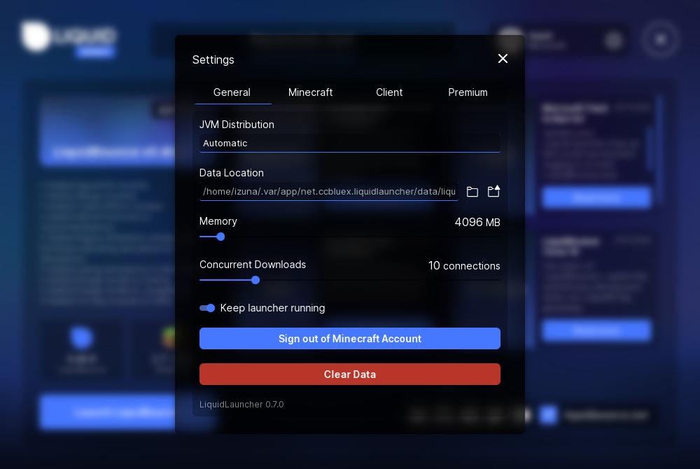
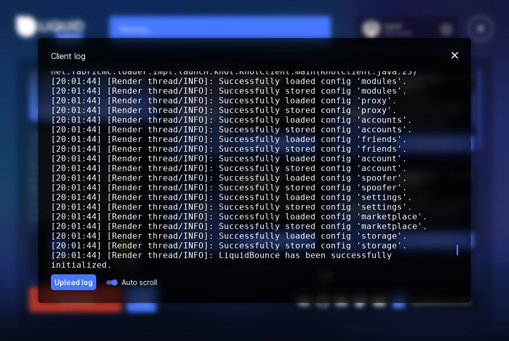

# LiquidLauncher

A custom Minecraft launcher for LiquidBounce.

[](https://liquidbounce.net)
[](https://forums.ccbluex.net)
[](https://liquidbounce.net/discord)
[](https://youtube.com/CCBlueX)

## Installation

Download the launcher for Windows, macOS or Linux from [liquidbounce.net](https://liquidbounce.net/download) or the [releases](https://github.com/CCBlueX/LiquidLauncher/releases).

- **Arch Linux:** `liquidlauncher-bin` or `liquidlauncher-appimage` from the AUR
- **NixOS:** `nix run github:CCBlueX/LiquidLauncher`, or add the flake's `packages.${pkgs.system}.default` to `environment.systemPackages`

## Screenshots

<table>
  <tr>
    <td></td>
    <td></td>
  </tr>
  <tr>
    <td></td>
    <td></td>
  </tr>
  <tr>
    <td></td>
  </tr>
</table>

## Issues

If you notice any bugs or missing features, let us know by opening an [issue](https://github.com/CCBlueX/LiquidLauncher/issues). For support, [contact us](https://ccbluex.net/contact). The imprint is at [ccbluex.net/imprint](https://ccbluex.net/imprint).

## License

This project is subject to the [GNU General Public License v3.0](LICENSE). This does only apply for source code located directly in this clean repository. During the development and compilation process, additional source code may be used to which we have obtained no rights. Such code is not covered by the GPL license.

For those who are unfamiliar with the license, here is a summary of its main points. This is by no means legal advice nor legally binding.

You are allowed to

- use
- share
- modify

this project entirely or partially for free and even commercially. However, please consider the following:

- **You must disclose the source code of your modified work and the source code you took from this project. This means you are not allowed to use code from this project (even partially) in a closed-source (or even obfuscated) application.**
- **Your modified application must also be licensed under the GPL**

Do the above and share your source code with everyone; just like we do.

## Icons

We use [Clarity Line Icons](https://www.svgrepo.com/collection/clarity-line-icons/) for this project.

## Compile it yourself!

LiquidLauncher is using Tauri and is written in the programming language Rust, so make sure that it is installed properly. Instructions can be found on [Rust's website](https://www.rust-lang.org/learn/get-started). It also requires NodeJS and bun.

```sh
git clone --recurse-submodules https://github.com/CCBlueX/LiquidLauncher
cd LiquidLauncher
bun install && bun run build
bun run tauri dev    # start the launcher
bun run tauri build  # or build it
```

## Contributing

We appreciate contributions. So if you want to support us, feel free to make changes to LiquidLauncher's source code and submit a pull request.

## Commits

`type(scope): subject`, lowercase, no trailing period.

`feat` `fix` `refactor` `chore` `docs`

Add a short body when the subject alone leaves the next reader guessing.
