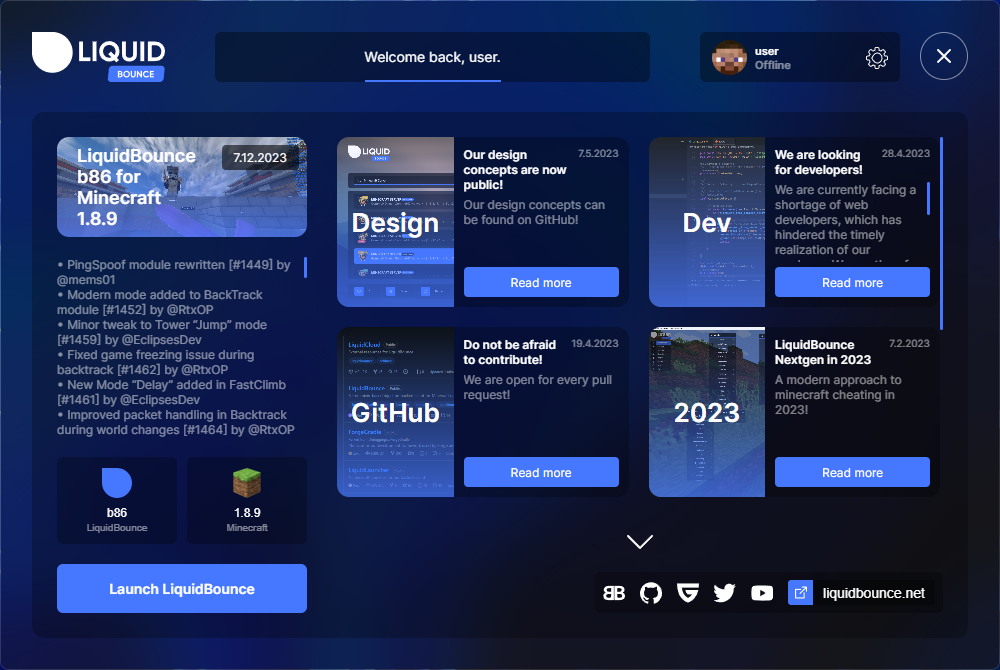
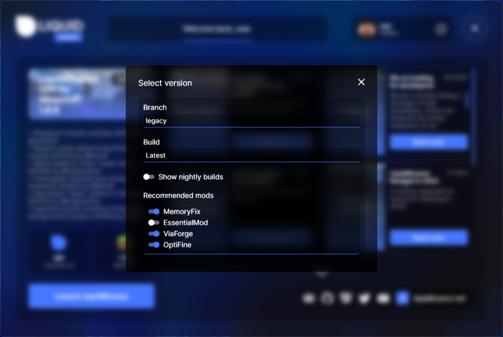
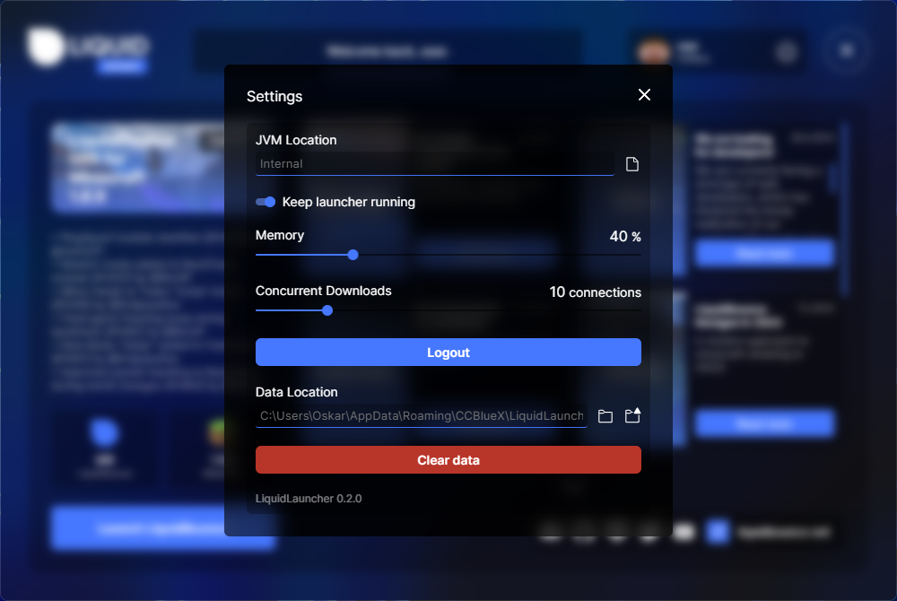
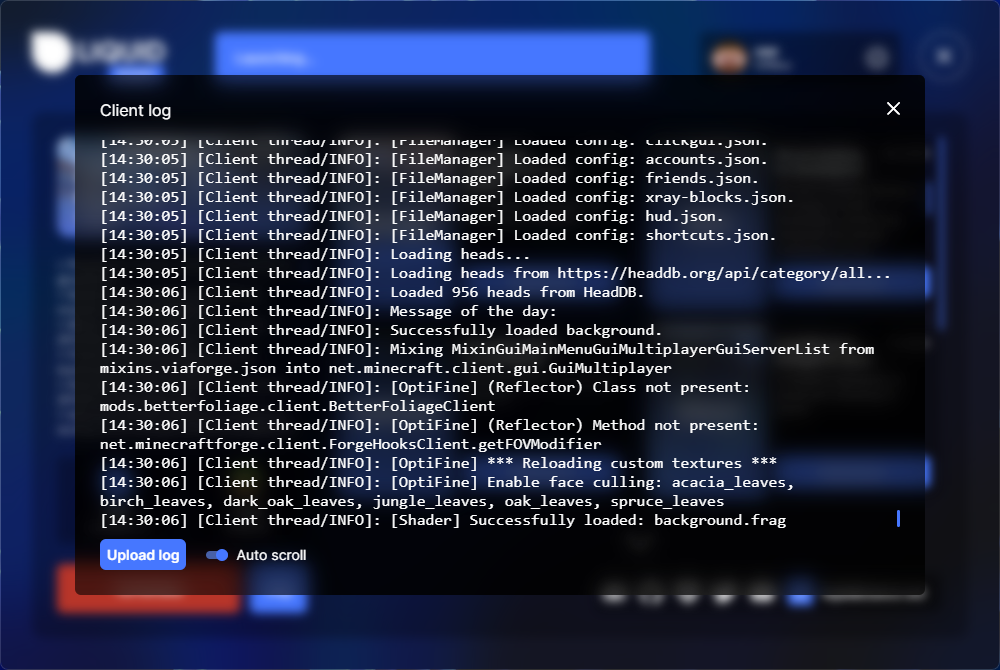

# LiquidLauncher
The official launcher for LiquidBounce.

Website: https://liquidbounce.net \
Forum: https://forums.ccbluex.net \
Guilded: https://guilded.gg/CCBlueX \
YouTube: https://youtube.com/CCBlueX \
Twitter: https://twitter.com/CCBlueX

## Screenshots
<table>
    <tr>
        <td>
            
        </td>
        <td>
            
        </td>
    </tr>
    <tr>
        <td>
            
        </td>
        <td>
            
        </td>
    </tr>
    <tr>
        <td>
            
        </td>
    </tr>
</table>

## Issues
If you notice any bugs or missing features, you can let us know by opening an issue [here](https://github.com/CCBlueX/LiquidLauncher/issues).

## License
This project is subject to the [GNU General Public License v3.0](LICENSE). This does only apply for source code located directly in this clean repository. During the development and compilation process, additional source code may be used to which we have obtained no rights. Such code is not covered by the GPL license.

For those who are unfamiliar with the license, here is a summary of its main points. This is by no means legal advice nor legally binding.

You are allowed to
- use
- share
- modify

this project entirely or partially for free and even commercially. However, please consider the following:

- **You must disclose the source code of your modified work and the source code you took from this project. This means you are not allowed to use code from this project (even partially) in a closed-source (or even obfuscated) application.**
- **Your modified application must also be licensed under the GPL** 

Do the above and share your source code with everyone; just like we do.

## Icons
We use [Clarity Line Icons](https://www.svgrepo.com/collection/clarity-line-icons/) for this project.

## Compile it yourself!
LiquidLauncher is using Tauri and is written in the programming language Rust, so make sure that it is installed properly. Instructions can be found on [Rust's website](https://www.rust-lang.org/learn/get-started). It also requires NodeJS and yarn.
1. Clone the repository using `git clone --recurse-submodules https://github.com/CCBlueX/LiquidLauncher`. 
2. Navigate into your local repository folder.
3. Execute the command `yarn && yarn build`
4. Now you can start the launcher using `npm run tauri dev` or build it by using `npm run tauri build`

## Contributing

We appreciate contributions. So if you want to support us, feel free to make changes to LiquidLauncher's source code and submit a pull request.
